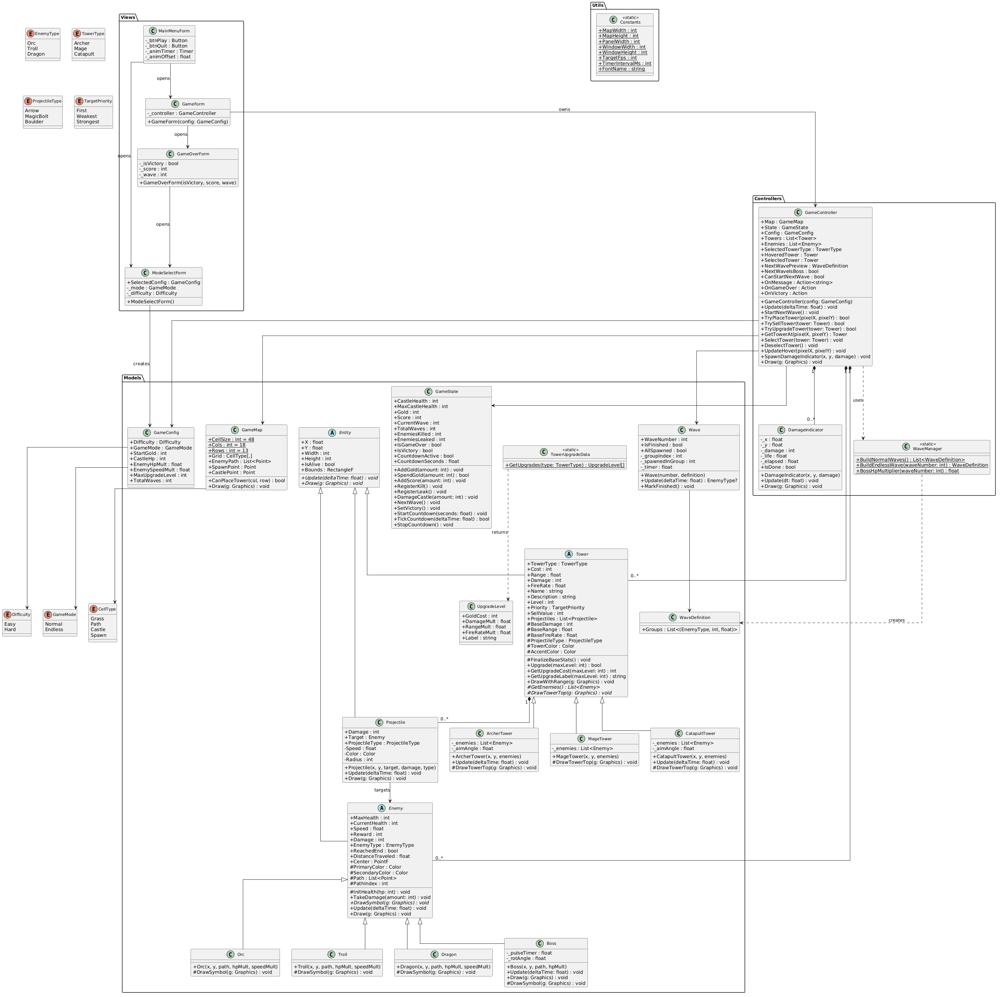

# Tower Defense

A classic tower defense game built with **C# / Windows Forms (.NET)**. Defend your castle against waves of enemies by placing and upgrading towers on a fixed grid map.

---

## Table of Contents

- [Gameplay Overview](#gameplay-overview)
- [Game Modes & Difficulty](#game-modes--difficulty)
- [Controls](#controls)
- [Towers](#towers)
- [Enemies](#enemies)
- [Wave System](#wave-system)
- [Economy](#economy)
- [Project Architecture](#project-architecture)
  - [Entry Point](#entry-point)
  - [Models](#models)
  - [Views](#views)
  - [Controllers](#controllers)
  - [Utils](#utils)
- [Class Diagram](#class-diagram)

---

## Gameplay Overview

Enemies spawn from the **START** portal on the left side of the map and follow a fixed winding path toward your **CASTLE** on the right. Your goal is to place towers on grass tiles to kill enemies before they reach the castle. Each enemy that slips through deals damage to your castle. The game ends when the castle HP reaches zero (defeat) or all waves are cleared (victory in Normal mode).

The game loop runs at **60 FPS** using a `System.Windows.Forms.Timer`.

---

## Game Modes & Difficulty

Configured in `ModeSelectForm` before each session and stored in `GameConfig`.

### Game Modes

| Mode    | Description |
|---------|-------------|
| **Normal** | 10 fixed waves. A boss spawns on wave 10. Win by surviving all waves. |
| **Endless** | Infinite waves with scaling difficulty. A boss appears every 10 waves. No victory condition — survive as long as possible. |

### Difficulty

| Difficulty | Starting Gold | Castle HP | Enemy HP | Enemy Speed | Max Tower Level |
|------------|--------------|-----------|----------|-------------|-----------------|
| **Easy**   | 200g          | 30        | ×1.0     | ×1.0        | Lv 1 (no upgrades in Normal Easy) |
| **Hard**   | 120g          | 15        | ×1.5     | ×1.2        | Lv 2 (Normal Hard) / Lv 3 (Endless) |

> Endless mode always allows upgrades up to **level 3** regardless of difficulty.

---

## Controls

| Action | Input |
|--------|-------|
| Select tower type | Click **ARC / MAG / CAT** buttons in the side panel |
| Place tower | Left-click a **grass** tile on the map |
| Select placed tower | Left-click an existing tower |
| Upgrade tower | Click **Upgrade** in the side panel (when a tower is selected) |
| Sell tower | Click **Sell** in the side panel (returns 50% of total gold spent) |
| Change targeting priority | Cycle **First / Weakest / Strongest** buttons when a tower is selected |
| Start next wave manually | Click **Start Wave** button (waves also auto-start after a 5-second countdown) |

---

## Towers

Towers can only be placed on **grass** tiles. Each occupies one 48×48 cell. Towers automatically target and shoot enemies in range based on the selected priority.

### Tower Types

| Tower | Cost | Damage | Range | Fire Rate | Projectile | Description |
|-------|------|--------|-------|-----------|------------|-------------|
| **Archer** | 50g | 15 | 120px | 2.0/s | Arrow | Fast attack, low damage. Rotates to aim at target. |
| **Mage** | 100g | 35 | 160px | 1.0/s | Magic Bolt | Balanced. Wide range, glowing projectile. |
| **Catapult** | 150g | 80 | 200px | 0.5/s | Boulder | Slow but devastating damage. Longest range. |

### Targeting Priorities

Each tower can be individually configured to target:

- **First** — enemy furthest along the path (default)
- **Weakest** — enemy with lowest current HP
- **Strongest** — enemy with highest current HP

### Upgrades

Available in Hard and Endless modes. Each upgrade multiplies the tower's base damage, range, and fire rate.

| Tower | Level 2 | Level 3 |
|-------|---------|---------|
| Archer | +40g — Sharp Arrows (×1.5 dmg, ×1.3 rate) | +80g — Master Archer (×2.5 dmg, ×1.6 rate) |
| Mage | +75g — Arcane Focus (×1.6 dmg, ×1.2 rate) | +150g — Archmage (×2.8 dmg, ×1.5 rate) |
| Catapult | +100g — Heavy Boulder (×1.7 dmg, ×1.2 rate) | +200g — Siege Engine (×3.0 dmg, ×1.4 rate) |

Selling a tower returns **50%** of all gold spent on it (including upgrades).

---

## Enemies

All enemies follow the same fixed path from spawn to castle. Each has HP, speed, gold reward, and castle damage values.

| Enemy | HP (base) | Speed | Reward | Castle Damage | Notes |
|-------|-----------|-------|--------|---------------|-------|
| **Orc** | 60 | 80 px/s | 10g | 1 HP | Basic enemy. Appears from wave 1. |
| **Troll** | 200 | 45 px/s | 20g | 2 HP | Slow and very tanky. Appears from wave 3. |
| **Dragon** | 120 | 120 px/s | 50g | 5 HP | Fast and dangerous. Appears from wave 5. |
| **Boss** | 800 | 35 px/s | 200g | 8 HP | Spawns every 10th wave. HP scales ×1.5 per subsequent boss. Animated pulsing glow and rotating crown orbs. |

All enemy HP and speed values are multiplied by the difficulty modifiers from `GameConfig`. In Endless mode, stats also scale per wave.

A **color-coded health bar** is drawn above every enemy (green → yellow → red). The Boss has an extended health bar with a `BOSS` label.

---

## Wave System

Waves are managed by `Wave` and `WaveManager`.

Each wave is a `WaveDefinition` containing one or more **groups** — a tuple of `(EnemyType, Count, SpawnInterval)`. Enemies within a group spawn one at a time with the given interval in seconds.

### Normal Mode (10 fixed waves)

Defined statically in `WaveManager.BuildNormalWaves()`:

- Waves 1–2: Orcs only
- Waves 3–4: Orcs + Trolls
- Wave 5: First Dragon appears
- Waves 6–9: Growing mix of all three types
- Wave 10: Orc + Dragon swarm **+ Boss**

### Endless Mode

Generated dynamically by `WaveManager.BuildEndlessWave(n)`:

- Enemy counts and spawn speed scale by `1 + (wave - 1) × 0.15`
- Waves 1–3: Orcs only
- Waves 4–6: Orcs + Trolls
- Wave 7+: All three types
- Every 10th wave spawns a Boss with `BossHpMultiplier` applied

### Wave Transitions

After a wave ends, a **5-second countdown** starts automatically. The player can also click **Start Wave** to begin earlier. When only 1 enemy remains alive, a secondary 5-second timer starts to skip to the next wave if the last enemy is taking too long.

---

## Economy

| Event | Gold change |
|-------|-------------|
| Kill Orc | +10g |
| Kill Troll | +20g |
| Kill Dragon | +50g |
| Kill Boss | +200g |
| Place tower | −tower cost |
| Upgrade tower | −upgrade cost |
| Sell tower | +50% of total gold spent |

Score is also tracked separately: each kill adds `reward × 10` points. The final score is shown on the Game Over / Victory screen.

---

## Project Architecture

The project follows an **MVC** (Model-View-Controller) pattern.

```
TowerDefense/
├── Program.cs
├── Models/
│   ├── Entity.cs
│   ├── Enemy.cs          (Orc, Troll, Dragon)
│   ├── Boss.cs
│   ├── Tower.cs          (ArcherTower, MageTower, CatapultTower)
│   ├── Projectile.cs
│   ├── GameMap.cs
│   ├── GameState.cs
│   ├── GameConfig.cs
│   ├── Wave.cs
│   └── TowerUpgrade.cs
├── Views/
│   ├── MainMenuForm.cs
│   ├── ModeSelectForm.cs
│   ├── GameForm.cs
│   └── GameOverForm.cs
├── Controllers/
│   ├── GameController.cs
│   └── WaveManager.cs
└── Utils/
    └── Constants.cs
```

---

### Entry Point

**`Program.cs`** — Starts the application with `Application.Run(new MainMenuForm())`.

---

### Models

#### `Entity` (abstract)
Base class for all game objects. Holds position (`X`, `Y`), size (`Width`, `Height`), `IsAlive` flag, and `Bounds` rectangle. Declares abstract `Update(float deltaTime)` and `Draw(Graphics g)` methods.

#### `Enemy` (abstract) : Entity
Base class for all enemies. Manages health (`CurrentHealth`, `MaxHealth`), movement along the path (`PathIndex`), `Speed`, `Reward`, `Damage`, and `EnemyType`. Implements path-following movement in `Update()`. Subclasses implement `DrawSymbol()` to render a unique visual.

- **`Orc`** — Basic enemy. 60 HP, speed 80. Red eyes and ivory tusks.
- **`Troll`** — Tank. 200 HP, speed 45. Large orange eyes with angry brow.
- **`Dragon`** — Fast attacker. 120 HP, speed 120. Wing triangles and yellow eyes.

#### `Boss` : Enemy
Special enemy that appears on every 10th wave. 800 base HP (scaled), speed 35, deals 8 castle damage. Renders an animated outer glow (sine-wave pulse), a rotating crown of 4 orbs, and a glowing inner eye. Displays a wider purple health bar with a `BOSS` label.

#### `Tower` (abstract) : Entity
Base class for all towers. Holds `TowerType`, `Cost`, `Range`, `Damage`, `FireRate`, `Level`, `Priority`, and a list of active `Projectile` objects. Each frame: removes dead projectiles, ticks live ones, and fires at the best target in range. Upgrade applies stat multipliers from `TowerUpgradeData`. Sell value = 50% of `_totalGoldSpent`.

- **`ArcherTower`** — 50g, 15 dmg, range 120, 2.0/s. Rotates a bow-and-arrow sprite toward the target.
- **`MageTower`** — 100g, 35 dmg, range 160, 1.0/s. Static magic-orb sprite.
- **`CatapultTower`** — 150g, 80 dmg, range 200, 0.5/s. Rotates a top-down catapult sprite toward the target.

#### `Projectile` : Entity
Moves toward a target enemy each frame at its type-specific speed. On contact, calls `Target.TakeDamage(Damage)` and sets itself to dead. Three visual types: `Arrow` (yellow), `MagicBolt` (cyan with glow), `Boulder` (gray).

#### `GameMap`
18×13 grid of `CellType` values (`Grass`, `Path`, `Castle`, `Spawn`). Holds the fixed 60-point `EnemyPath` list. Draws a checkerboard grass pattern, tan path tiles, a green spawn portal, and a stone castle. `CanPlaceTower(col, row)` returns true only for `Grass` cells.

#### `GameState`
Runtime snapshot of the session: `CastleHealth`, `Gold`, `Score`, `CurrentWave`, kill/leak counters, and game-over flags. Also manages the between-wave countdown timer (`StartCountdown`, `TickCountdown`).

#### `GameConfig`
Immutable session settings produced by `ModeSelectForm`. Derives `StartGold`, `CastleHp`, `EnemyHpMult`, `EnemySpeedMult`, and `MaxUpgradeLevel` from the chosen `Difficulty` and `GameMode`.

#### `Wave`
Manages a single active wave. Iterates through the groups in a `WaveDefinition`, accumulates time, and returns the next `EnemyType` to spawn each tick. Sets `AllSpawned` when the last group is exhausted.

#### `WaveDefinition`
Data object — a list of `(EnemyType, Count, Interval)` tuples.

#### `TowerUpgrade` / `UpgradeLevel` / `TowerUpgradeData`
`UpgradeLevel` holds `GoldCost`, `DamageMult`, `RangeMult`, `FireRateMult`, and a display label. `TowerUpgradeData.GetUpgrades(TowerType)` returns the two upgrade levels for each tower type. `TargetPriority` enum (`First`, `Weakest`, `Strongest`) is also defined here.

---

### Views

#### `MainMenuForm`
Full-screen menu with an animated checkerboard background (`_animTimer` at 60 Hz), the game title, a tower preview sprite, and tower hint text at the bottom. Opens `ModeSelectForm` on Play.

#### `ModeSelectForm`
Modal dialog for choosing game mode (Normal / Endless) and difficulty (Easy / Hard). Toggle buttons highlight the active selection and update a description label. On confirm, creates a `GameConfig` and returns `DialogResult.OK`.

#### `GameForm`
Main game window (1064×624). Owns a `GameController`. A `System.Windows.Forms.Timer` fires every ~16 ms to call `controller.Update(deltaTime)` and `Invalidate()`. Renders the game scene, HUD (gold, HP, wave, score, countdown), side panel (tower buttons, wave preview, selected-tower info with upgrade/sell/priority controls), and a floating message bar. Handles mouse clicks to place towers or select existing ones.

#### `GameOverForm`
Small modal shown on win or loss. Displays a gradient background (green for victory, red for game over), the result header, wave count, and final score. Buttons for **Main Menu** and **Play Again**.

---

### Controllers

#### `GameController`
Central game logic. Each `Update(deltaTime)` call:
1. Advances the active `Wave` and spawns enemies.
2. Spawns the `Boss` when all regular enemies of a boss wave are queued.
3. Updates all enemies — awards gold/score for kills, damages castle for leakers.
4. Updates all towers (targeting + firing).
5. Ticks the between-wave countdown.
6. Updates and prunes `DamageIndicator` objects.

Also handles `TryPlaceTower`, `TrySellTower`, `TryUpgradeTower`, tower hover/selection, and exposes `Draw(Graphics g)` which renders map → towers → projectiles → enemies → damage indicators in order.

Fires events: `OnMessage` (string notification), `OnGameOver`, `OnVictory`.

#### `WaveManager` (static)
- `BuildNormalWaves()` — returns the 10 hardcoded `WaveDefinition` objects.
- `BuildEndlessWave(n)` — generates a scaled wave definition on demand.
- `BossHpMultiplier(waveNumber)` — returns `1 + (bossCount - 1) × 0.5` so each subsequent boss is 50% tougher.

#### `DamageIndicator`
Floating red damage number that rises and fades over 0.8 seconds after an enemy is hit.

---

### Utils

#### `Constants` (static)
Global constants: map dimensions (864×624), panel width (200), window size (1064×624), target FPS (60), timer interval (16 ms), and the UI font name (`"Segoe UI"`).

---

## Class Diagram



The diagram illustrates the full inheritance and dependency graph:

- `Entity` ← `Enemy` ← `Orc`, `Troll`, `Dragon`, `Boss`
- `Entity` ← `Tower` ← `ArcherTower`, `MageTower`, `CatapultTower`
- `Entity` ← `Projectile`
- `GameController` owns `GameMap`, `GameState`, `GameConfig`, lists of `Tower` and `Enemy`, and uses `WaveManager`
- `GameForm` (View) owns `GameController` and renders everything
- `MainMenuForm` → `ModeSelectForm` → `GameForm` → `GameOverForm` navigation chain